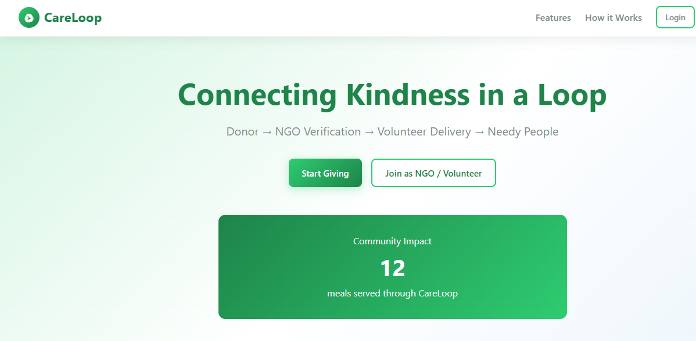
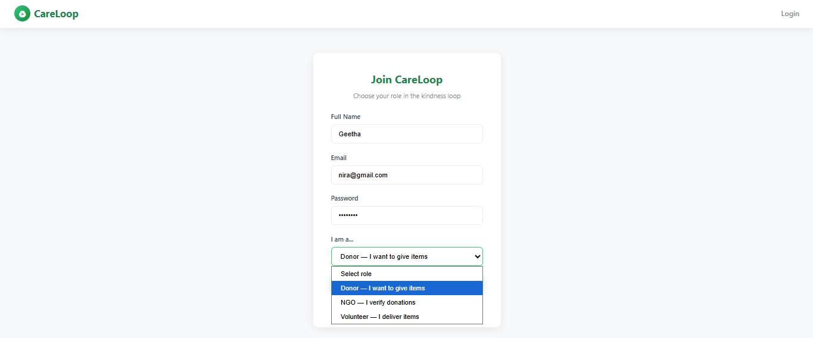
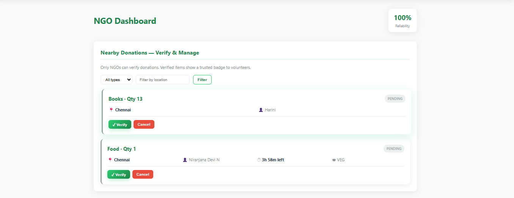
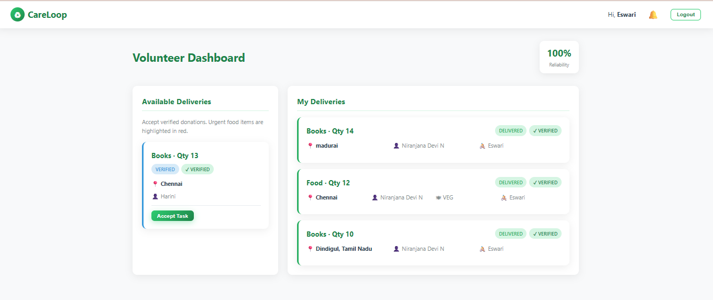

# CareLoop

**Connecting Kindness in a Loop**

CareLoop connects donors, NGOs, and volunteers to redistribute food, clothes, books, and essentials to people in need.

## Project Structure

```
careloop/
├── backend/          # Spring Boot REST API (Java 17)
├── frontend/         # HTML, CSS, Vanilla JS
├── database/         # MySQL schema (schema.sql)
└── README.md
```

## Prerequisites

- Java 17+
- Maven 3.8+
- MySQL 8+
- A modern web browser

## Setup

### 1. Database

```sql
-- Run in MySQL
source database/schema.sql
```

Or let Spring Boot auto-create tables (`spring.jpa.hibernate.ddl-auto=update`).

Update credentials in `backend/src/main/resources/application.properties`:

```properties
spring.datasource.username=root
spring.datasource.password=YOUR_PASSWORD
```

### 2. Backend

```bash
cd backend
mvn spring-boot:run
```

API runs at: `http://localhost:8080`

### 3. Frontend

Open `frontend/index.html` in a browser, or serve the folder:

```bash
cd frontend
npx serve .
```

> **Note:** For API calls to work, the backend must be running. If you use a file:// URL, some browsers may block CORS — use a local server instead.

## User Roles

| Role | Dashboard | Actions |
|------|-----------|---------|
| **Donor** | `donor-dashboard.html` | Add donations, view status, cancel |
| **NGO** | `ngo-dashboard.html` | Verify donations, manage pipeline |
| **Volunteer** | `volunteer-dashboard.html` | Accept tasks, deliver items |

## API Endpoints

| Method | Endpoint | Description |
|--------|----------|-------------|
| POST | `/api/auth/register` | Sign up |
| POST | `/api/auth/login` | Login (returns JWT) |
| GET | `/api/auth/me` | Current user profile |
| POST | `/api/donations` | Create donation (Donor) |
| GET | `/api/donations` | List donations (role-based) |
| PUT | `/api/donations/{id}/verify` | NGO verify |
| PUT | `/api/donations/{id}/assign` | Volunteer accept |
| PUT | `/api/donations/{id}/out-for-delivery` | Start delivery |
| PUT | `/api/donations/{id}/deliver` | Mark delivered |
| PUT | `/api/donations/{id}/cancel` | Cancel with reason |
| GET | `/api/notifications` | User notifications |

## Real-World Features

- **Anti-fake donations:** Only NGOs can verify; verified badge in UI
- **Food safety:** 4-hour auto-expiry from prepared time; urgent red highlight
- **Volunteer delivery:** Task acceptance and status tracking
- **Cancellation tracking:** Reason required; 3+ cancellations → Unreliable
- **Trust score:** Reliability % decreases with cancellations
- **Notifications:** Verified, assigned, expiring, delivered events

## Donation Status Flow

```
PENDING → VERIFIED → ASSIGNED → OUT_FOR_DELIVERY → DELIVERED
                                              ↘ EXPIRED / CANCELLED
```

## Tech Stack

- Frontend: HTML5, CSS3, Vanilla JavaScript (Fetch API)
- Backend: Spring Boot 3, Java 17
- Database: MySQL

---

## 📸 Screenshots

### 🏠 Home Page


### 🔐 Login Page


### 📊 Donor Dashboard


### 🏢 NGO Dashboard


### 🚚 Volunteer Dashboard



© 2026 CareLoop
